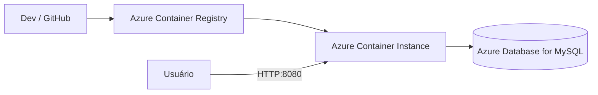

`markdown
# Sprint 3 — DevOps Tools & Cloud Computing

## 1. Descrição da solução
Aplicação **.NET** containerizada, publicada no **Azure Container Registry (ACR)** e executada no **Azure Container Instances (ACI)**. O banco é um **MySQL Flexible Server (PaaS)** rodando na Azure.  
Toda a comunicação App↔BD acontece via connection string injetada como variável de ambiente.

## 2. Benefícios para o negócio
- **Agilidade:** imagens versionadas e prontas para deploy em segundos.
- **Escalabilidade sob demanda:** ACI é serverless, cobra apenas pelo tempo em execução.
- **Gestão simplificada:** MySQL PaaS cuida de backup, atualização e disponibilidade.
- **Segurança:** container roda como usuário **não-root** e banco pode ser restringido por rede.

## 3. Arquitetura


## 4. Pré-requisitos

* Conta Azure ativa e permissões para ACR, ACI e MySQL Flexible
* Azure CLI e Docker Desktop (se build local)
* Cliente MySQL ou uso do `az mysql flexible-server execute`

## 5. Passo a passo do deploy

## Link do video demonstrativo passo a passo: 

1. **Criar ACR**

   ```bash
   az group create -n $RESOURCE_GROUP -l $LOCATION
   az acr create -g $RESOURCE_GROUP -n $ACR_NAME --sku Basic --admin-enabled true
   
2. **Build + push da imagem**

   ```bash
   docker build -t $IMAGE_NAME:$IMAGE_TAG -f Dockerfile .
   docker tag $IMAGE_NAME:$IMAGE_TAG $LOGIN_SERVER/$IMAGE_NAME:$IMAGE_TAG
   docker push $LOGIN_SERVER/$IMAGE_NAME:$IMAGE_TAG
   
3. **Criar MySQL PaaS**

   ```bash
   az mysql flexible-server create \
     -g $RESOURCE_GROUP -n $MYSQL_NAME -l $LOCATION_DB \
     --admin-user $MYSQL_ADMIN_USER --admin-password $MYSQL_ADMIN_PASSWORD \
     --version 8.0 --public-access all \
     --tier Burstable --sku-name Standard_B2s --storage-size 20
   az mysql flexible-server db create -g $RESOURCE_GROUP -s $MYSQL_NAME -d $MYSQL_DB
   
4. **Aplicar DDL + Seeds**

   ```bash
   az mysql flexible-server execute --name $MYSQL_NAME --admin-user $MYSQL_ADMIN_USER --admin-password $MYSQL_ADMIN_PASSWORD --file script_bd.sql
   az mysql flexible-server execute --name $MYSQL_NAME --admin-user $MYSQL_ADMIN_USER --admin-password $MYSQL_ADMIN_PASSWORD --file seed_bd.sql
   
5. **Deploy no ACI**

   ```bash
   az container create \
     -g $RESOURCE_GROUP -n $ACI_NAME \
     --image $LOGIN_SERVER/$IMAGE_NAME:$IMAGE_TAG \
     --os-type Linux \
     --registry-login-server $LOGIN_SERVER \
     --registry-username $ACR_USER \
     --registry-password $ACR_PWD \
     --ports $APP_PORT \
     --ip-address Public \
     --environment-variables "ConnectionStrings__DefaultConnection=$CONN_STR"
   

## 6. Testes (CRUD no BD)

### No MySQL

```sql
INSERT INTO tbl_moto (id_moto, placa, chassi, status, modelo) VALUES (200,'ZZZ9A99','9C1R9999999999999','Ativa','TesteMoto A');

SELECT * FROM tbl_moto WHERE id_moto=200;

UPDATE tbl_moto SET modelo='TesteMoto A+' WHERE id_moto=200;

DELETE FROM tbl_moto WHERE id_moto=200;
