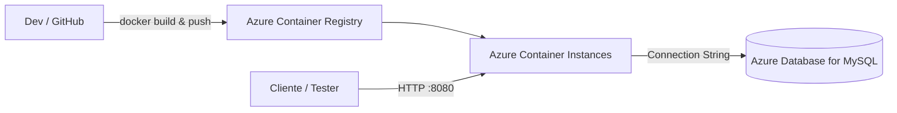

# Sprint 3 — DevOps Tools & Cloud Computing (ACR + ACI + MySQL)

> **Opção escolhida**: ACR + ACI, com banco MySQL em nuvem (Azure Database for MySQL Flexible Server).  
> **Requisitos alinhados ao enunciado**: imagens oficiais, container **não root**, scripts de build e execução, CRUD no BD, README com passo a passo e vídeo demonstrativo.

## 1) Descrição da solução
Aplicação **.NET** containerizada, publicada no **Azure Container Registry (ACR)** e executada no **Azure Container Instances (ACI)**. O **MySQL** roda como serviço PaaS (**Azure Database for MySQL – Flexible Server**). A aplicação lê/grava dados do banco por meio de uma connection string fornecida via variável de ambiente.

## 2) Benefícios para o negócio
- **Agilidade de deploy** com imagens versionadas no ACR.
- **Custo sob demanda** com ACI (liga/desliga rapidamente).
- **Gestão simplificada de banco** (PaaS gerenciado, backup automático, patching e escalabilidade).
- **Segurança**: container executa **sem privilégios de root** e a base com acesso público controlado para fins acadêmicos (ajuste para VNET em produção).

## 3) Arquitetura

> Observação: O container utiliza imagem oficial do .NET (mcr.microsoft.com/dotnet) e executa como **usuário não-root**.

## 4) Pré-requisitos
- Docker CLI e Docker Desktop
- Azure CLI (`az`) e login feito: `az login`
- MySQL client (`mysql`)
- Assinatura Azure ativa

## 5) Variáveis
1. Copie `.env.sample` para `.env` e preencha.
2. Opcionalmente substitua `$RANDOM` para nomes únicos previsíveis.

## 6) Passo a passo (deploy completo)
> Comandos prontos em `scripts/`.

1. **Criar ACR**
   ```bash
   ./scripts/create-acr.sh
   ```

2. **Build & push da imagem**
   - Ajuste os caminhos de projeto no `Dockerfile` (linha COPY do `*.csproj` e nome do DLL).
   ```bash
   ./scripts/build-and-push.sh
   ```

3. **Criar MySQL PaaS + DDL + Seeds**
   ```bash
   ./scripts/create-mysql.sh
   ```

4. **Deploy no ACI (usando imagem do ACR)**
   ```bash
   ./scripts/deploy-aci.sh
   ```
   - Saída esperada: `provisioningState` e IP público. Acesse: `http://<IP>:${APP_PORT}`

5. **Logs e status**
   ```bash
   az container logs -g $RESOURCE_GROUP -n $ACI_NAME
   az container show -g $RESOURCE_GROUP -n $ACI_NAME --query "{state:provisioningState,ip:ipAddress.ip}" -o tsv
   ```

6. **Rodar localmente (contra o MySQL da Azure)**
   ```bash
   ./scripts/run-local.sh
   # Abra http://localhost:${APP_PORT}
   ```

## 7) Banco de dados (DDL e dados)
- Arquivo **DDL** (somente estrutura): [`script_bd.sql`](script_bd.sql)
- Arquivo **Seeds** (dados de exemplo): [`seed_bd.sql`](seed_bd.sql)

> Dica: se quiser rodar manualmente no cliente MySQL:
```sql
mysql -h <FQDN> -u <USER> -p
source script_bd.sql;
source seed_bd.sql;
```

## 8) Demonstração de CRUD **direto no banco** (para o vídeo)
> Utilize a tabela `tbl_moto` para evidenciar as operações (ajuste conforme desejar).

**Create (INSERT):**
```sql
INSERT INTO appdb.tbl_moto (id_moto, placa, chassi, status, modelo)
VALUES (200, 'ZZZ9A99', '9C1R9999999999999', 'Ativa', 'TesteMoto');
```

**Read (SELECT):**
```sql
SELECT * FROM appdb.tbl_moto WHERE id_moto IN (1, 200) ORDER BY id_moto;
```

**Update (UPDATE):**
```sql
UPDATE appdb.tbl_moto SET modelo = 'TesteMoto X' WHERE id_moto = 200;
SELECT * FROM appdb.tbl_moto WHERE id_moto = 200;
```

**Delete (DELETE):**
```sql
DELETE FROM appdb.tbl_moto WHERE id_moto = 200;
SELECT * FROM appdb.tbl_moto WHERE id_moto = 200; -- deve retornar vazio
```

> Lembre de **exibir o resultado no banco** após cada operação, conforme o item 4.2 da avaliação.

## 9) Testes de API (se sua aplicação expõe endpoints)
> Ajuste as rotas abaixo conforme sua aplicação. Exemplo genérico para um CRUD de motos:
```bash
# LISTAR
curl http://<IP_ACI>:${APP_PORT}/api/motos

# INSERIR
curl -X POST http://<IP_ACI>:${APP_PORT}/api/motos \
  -H "Content-Type: application/json" \
  -d '{"id_moto":201,"placa":"AAA1B23","chassi":"9BWZZZ377VT004299","status":"Ativa","modelo":"Mottu Pop"}'

# ATUALIZAR
curl -X PUT http://<IP_ACI>:${APP_PORT}/api/motos/201 \
  -H "Content-Type: application/json" \
  -d '{"id_moto":201,"placa":"AAA1B23","chassi":"9BWZZZ377VT004299","status":"Ativa","modelo":"Mottu E"}'

# APAGAR
curl -X DELETE http://<IP_ACI>:${APP_PORT}/api/motos/201
```

## 10) Limpeza (cleanup)
```bash
./scripts/teardown.sh
```

## 11) Itens para o PDF final (a ser anexado no LMS)
- **Nome completo e RM** de todos os integrantes
- **Link do repositório no GitHub**
- **Link do vídeo no YouTube**

## 12) Observações importantes
- A imagem base é **oficial**: `mcr.microsoft.com/dotnet/aspnet:8.0-alpine`.
- O container roda **como usuário não root** (veja `Dockerfile`).
- Connection String passada por variável de ambiente `ConnectionStrings__DefaultConnection` (padrão .NET).
- Em produção, prefira **rede privada (VNET)** para ACI ↔ MySQL, e `--public-access Disabled` no MySQL.

---

### Anexo: Como ajustar o Dockerfile ao seu projeto
1. Substitua `YourApp/YourApp.csproj` pelo caminho real do projeto.
2. Substitua `YourApp.dll` no ENTRYPOINT pelo nome do assembly de saída.
3. Se preferir, use `az acr build` para _remote build_:
   ```bash
   az acr build -r $ACR_NAME -t $IMAGE_NAME:$IMAGE_TAG .
   ```
